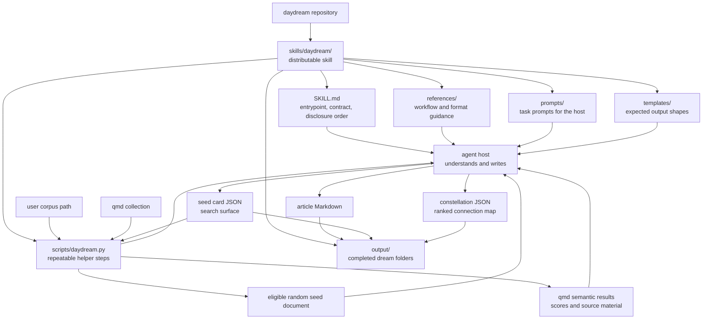

# Daydream

Daydream is a self-contained agent skill that starts from one random document in a local corpus, uses qmd semantic search to find meaningful echoes, then saves an article and the connection map behind it.

## Install

Install Daydream by copying the self-contained `skills/daydream/` directory into your host's skill directory; for Codex, run `mkdir -p ~/.codex/skills && cp -R skills/daydream ~/.codex/skills/daydream` from this repository.

The distributable product is `skills/daydream/`. A host such as Hermes, OpenClaw, Claude Code, or Codex should install that directory, read its `SKILL.md`, and load the deeper files only when the workflow reaches them.

## Requirements

- An agent host that can read an installed skill and work with local files.
- Python 3.11 or newer for the bundled helper script.
- qmd for normal semantic search over the target corpus.

Server and scheduled runs may also need qmd environment values such as `PATH`, `QMD_FORCE_CPU`, or `HF_ENDPOINT`. The helper accepts an env file on qmd-facing commands when the host needs an explicit runtime environment.

## What It Does

A normal dream follows this shape:

1. Select one eligible seed document from the user corpus.
2. Turn that seed into a JSON seed card that exposes claims, concepts, tensions, mechanisms, failure modes, and search questions.
3. Use qmd semantic search over the intended qmd collection to find near echoes, bridges, contrasts, and distant echoes.
4. Rank every connection that survives reading and topic-overlap filtering.
5. Write one article and save the JSON record of the seed and the JSON record of the constellation behind the article.

Daydream is not a corpus-wide clustering system and not a keyword search wrapper. qmd is the normal search layer; the host does the reading, judgment, and writing.

Connection density depends on the corpus. A small or narrow corpus plus strict rejection of surface-only overlap may produce only a few strong links. A larger and more varied corpus gives the dream more room to find bridges, contrasts, and distant echoes.

### Eligible Seed Documents

The random seed is chosen from corpus files that currently meet all of these rules:

- It is a readable UTF-8 text file with a `.md`, `.markdown`, or `.txt` extension.
- It is not inside any `output/` directory.
- Its file name is not a README-style name such as `README.md`.
- It is not empty or too short; after trimming, it must contain at least 24 characters.
- It is not just a link list.

JSON files are excluded from seed selection by default. The helper can allow them only when it is called with the explicit JSON option.

## Architecture



The package layout is:

```text
skills/daydream/
  SKILL.md
  scripts/
    daydream.py
  references/
    constellation-format.md
    cron.md
    dream-flow.md
    fallback-without-qmd.md
    outputs.md
    qmd-search.md
    qmd-setup.md
    ranking.md
    seed-card-format.md
  prompts/
    expand-with-semantic-search.md
    extract-seed-card.md
    rank-connections.md
    write-daydream-article.md
  templates/
    article.md
    constellation.json
    seed-card.json
  tests/
    test_daydream.py
  output/
    .gitignore
    .gitkeep
```

## File Guide

### Entry And Helper

| Path | Purpose |
| --- | --- |
| `skills/daydream/SKILL.md` | The main instruction file that tells a host when Daydream applies, what a normal dream requires, which rules cannot be skipped, and which deeper file to read at each stage. |
| `skills/daydream/scripts/daydream.py` | The helper for repeatable work: check a corpus, choose an eligible random seed, call qmd search with the requested scope, validate Daydream JSON, and save linked outputs into one folder. |

### Reference Documents

| Path | Purpose |
| --- | --- |
| `references/dream-flow.md` | The full manual run sequence from corpus input to saved outputs. Start here when executing a dream. |
| `references/seed-card-format.md` | The meaning of the seed card fields and the rules for extracting a usable seed search surface. |
| `references/qmd-search.md` | How seed-card fields fan out into multiple qmd semantic searches, how collection scoping works, and how to avoid topic-only retrieval. |
| `references/ranking.md` | How retrieved material becomes ranked connections instead of a pile of loosely related documents. |
| `references/constellation-format.md` | The required shape and meaning of the final connection map. |
| `references/outputs.md` | The saved file layout, naming pattern, and save checks for one completed dream. |
| `references/qmd-setup.md` | What qmd is, where to find its setup guidance, and what the host should check before using it. |
| `references/fallback-without-qmd.md` | The degraded path when qmd is unavailable and the user or schedule policy allows continuation. |
| `references/cron.md` | The extra rules for scheduled dreams, including the no-qmd policy. |

### Prompts

| Path | Purpose |
| --- | --- |
| `prompts/extract-seed-card.md` | Tells the host how to read the seed document and fill the seed card. |
| `prompts/expand-with-semantic-search.md` | Tells the host how to turn seed-card material into semantic search directions. |
| `prompts/rank-connections.md` | Tells the host how to keep meaningful connections, reject surface overlap, and rank the survivors. |
| `prompts/write-daydream-article.md` | Tells the host how to write the finished article from the seed and the ranked material without narrating the pipeline. |

### Templates

| Path | Purpose |
| --- | --- |
| `templates/seed-card.json` | The seed card template. It defines the JSON shape used to preserve the host's reading of the seed and to generate qmd search directions. |
| `templates/constellation.json` | The constellation template. It defines the JSON shape for nodes, edges, ranked connections, and search coverage. |
| `templates/article.md` | The minimal Markdown shell for the final article. |

### Tests

| Path | Purpose |
| --- | --- |
| `tests/test_daydream.py` | Focused checks for the helper script, including qmd probes, qmd env files, and qmd-only search recovery. |

### Generated Outputs

Each completed dream is saved as one folder:

```text
skills/daydream/output/
  YYYYMMDD-HHMMSS-keywords/
    YYYYMMDD-HHMMSS-keywords.md
    YYYYMMDD-HHMMSS-keywords.seed-card.json
    YYYYMMDD-HHMMSS-keywords.constellation.json
```

| Output | Purpose |
| --- | --- |
| `*.md` | The readable article produced by the dream, ending with a compact list of the documents and concepts that actually participated in the writing. |
| `*.seed-card.json` | The saved seed card for that run. It records what the seed meant before the search expanded outward. |
| `*.constellation.json` | The saved connection map for that run. It records the accepted ranked connections, their strength, the involved documents, and how the article used them. |
| `output/.gitignore` | Keeps generated dream folders out of the distributed skill package. |
| `output/.gitkeep` | Keeps the default output directory present in the package before any dream has run. |

## How The Main JSON Files Differ

The two JSON files answer different questions:

| JSON | Question It Answers | Main Contents |
| --- | --- | --- |
| Seed card | What did the host understand from the chosen seed before expanding the search? | Seed document identity, summary, claim, concepts, tensions, mechanisms, failure modes, dream questions, search exclusions, and evidence spans. |
| Constellation | What network of accepted connections came out of the search and writing process? | Article identity, document and concept nodes, tension and question nodes, edges, ranked connections, strengths, anti-overlap reasons, article usage, and search coverage. |

## Run It

Ask the host to use Daydream with a corpus path and the qmd collection name for that corpus. Resolve `<skill-dir>` to the installed `skills/daydream/` directory:

```bash
python3 <skill-dir>/scripts/daydream.py check --corpus /path/to/corpus
python3 <skill-dir>/scripts/daydream.py pick-seed --corpus /path/to/corpus
python3 <skill-dir>/scripts/daydream.py search --corpus /path/to/corpus --collection corpus-name "semantic search text from the seed card"
python3 <skill-dir>/scripts/daydream.py validate-seed-card /path/to/seed-card.json
python3 <skill-dir>/scripts/daydream.py validate-constellation /path/to/constellation.json
python3 <skill-dir>/scripts/daydream.py save-dream \
  --article /path/to/article.md \
  --seed-card /path/to/seed-card.json \
  --constellation /path/to/constellation.json \
  --keywords "memory feedback"
```

The save step writes to `<skill-dir>/output/` unless the host provides another output directory.

For a real qmd readiness check, pass the collection and one light probe query:

```bash
python3 <skill-dir>/scripts/daydream.py check \
  --corpus /path/to/corpus \
  --collection corpus-name \
  --qmd-probe-query "semantic smoke test" \
  --env-file /path/to/qmd.env
```

## Common Edits

Start here when you want to change Daydream instead of reading every file first.

### I Want To Change The Final Article Prompt

Edit:

- `prompts/write-daydream-article.md` for the writing instruction itself.
- `templates/article.md` when you want to change the starting article shape or the fixed article appendix.
- `SKILL.md` only when the promise or hard rule of the article changes, not for ordinary style tuning.

### I Want To Limit How Many Linked Documents A Dream Uses

Daydream currently has two different limits to think about:

1. Search batch size. `scripts/daydream.py` sets the default `--limit` for each qmd search call. A host can also pass `--limit <n>` for a specific run. If you change the default behavior, review `references/qmd-search.md` too.
2. Final connection policy. Daydream currently keeps every meaningful connection that survives reading and topic-overlap filtering, even when the article uses only part of them. That rule lives in `SKILL.md`, `references/ranking.md`, `prompts/rank-connections.md`, and `prompts/write-daydream-article.md`.

If you want a token-conscious mode such as “use at most N linked documents” or “write from only the top N accepted connections,” change the final connection policy files together. Do not only lower the qmd search limit: that reduces what is retrieved per search, but it does not by itself define how many accepted documents or connections the finished dream may keep.

### I Want To Change Scheduled Dream Behavior

Edit:

- `references/cron.md` for what a scheduled dream needs and what the scheduled prompt should carry.
- `references/fallback-without-qmd.md` when changing what a scheduled run does if qmd is unavailable.
- `SKILL.md` when the scheduling rule becomes part of the main Daydream contract.
- `scripts/daydream.py` only when the helper check or accepted `no_qmd_policy` values need to change.

The scheduler itself belongs to the host. Daydream defines the recurring dream rules; Hermes, OpenClaw, Claude Code, Codex, or another host decides how to run them on time.

### I Want To Change qmd Runtime Behavior

Edit:

- `references/qmd-setup.md` for collection setup and readiness checks.
- `references/qmd-search.md` for qmd search and recovery behavior.
- `references/cron.md` when the behavior matters specifically in scheduled runs.
- `scripts/daydream.py` when changing the env-file input, qmd probe, or recovery order.

The helper can pass qmd environment values from `--env-file`. That file is the practical place to define a scheduler-visible `PATH`, force CPU mode, or choose a model mirror when the host runtime needs it.

### I Want To Change What The Seed Card Searches

Edit:

- `references/qmd-search.md` for which seed-card fields become semantic search directions.
- `prompts/expand-with-semantic-search.md` for how the host expands those directions.
- `templates/seed-card.json`, `references/seed-card-format.md`, `prompts/extract-seed-card.md`, and `scripts/daydream.py` when the seed card fields themselves change.

### I Want To Change Seed Selection

Edit:

- `scripts/daydream.py` for the actual eligibility rules and random selection behavior.
- `SKILL.md` when the rule should be visible as part of the skill contract.
- `references/dream-flow.md` when the run sequence changes around selection.

### I Want To Change The Saved Outputs

Edit:

- `references/outputs.md` for the saved output rule.
- `scripts/daydream.py` for output folder names, file names, and saving behavior.
- `templates/seed-card.json` or `templates/constellation.json` when the saved JSON shape changes.
- `references/constellation-format.md`, the related prompts, and helper validation when constellation data changes.

## Change Map

Use this map when modifying the skill:

| Change | Files To Review Together |
| --- | --- |
| Change when the skill should activate or what it promises | `SKILL.md` |
| Change the end-to-end sequence | `SKILL.md`, `references/dream-flow.md` |
| Change seed-card fields or allowed values | `templates/seed-card.json`, `references/seed-card-format.md`, `prompts/extract-seed-card.md`, `scripts/daydream.py` |
| Change which seed-card material feeds qmd search | `references/qmd-search.md`, `prompts/expand-with-semantic-search.md`, and `SKILL.md` when the contract changes |
| Change qmd setup, scope, or failure guidance | `references/qmd-setup.md`, `references/qmd-search.md`, `references/fallback-without-qmd.md`, `scripts/daydream.py` when the helper command changes |
| Change ranking rules | `references/ranking.md`, `prompts/rank-connections.md`, `templates/constellation.json` when the saved record changes |
| Change constellation nodes, edges, or saved ranking fields | `templates/constellation.json`, `references/constellation-format.md`, `prompts/rank-connections.md`, `scripts/daydream.py` |
| Change article writing rules | `prompts/write-daydream-article.md`, `templates/article.md`, and `SKILL.md` when the contract changes |
| Change output names or folder layout | `references/outputs.md`, `scripts/daydream.py`, and this `README.md` |

When a JSON shape changes, update the template, the explanation, the prompt that writes it, and the helper validation that checks it. When helper behavior changes, update `tests/test_daydream.py` with it. That keeps hosts and future edits from drifting apart.
