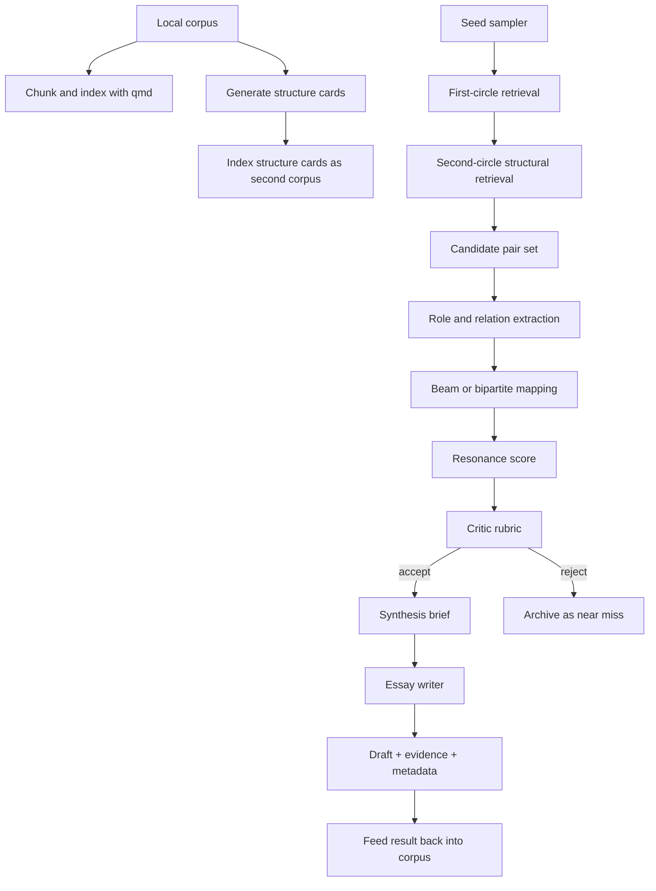

# Reproducing Ambien Structural Resonance as a Hermes Skill

## Executive Summary

The core of Ambien, as described in your prompt, is not generic RAG or semantic search. It is a **cross-document analogical discovery system** that prefers **deep relational similarity over topical overlap**, then turns that match into a synthesis essay. In the open literature and code ecosystem, there is no single off-the-shelf package that already does this end to end for arbitrary personal corpora. The closest public blueprints are: **YARN** for decomposing narratives into units, abstractions, stages, and scored mappings; **Life is a Circus and We are the Clowns** for extracting analogies between procedural/situational texts; **FAME** for scalable relation-based entity mapping with interpretable outputs; **qmd** for local hybrid retrieval with query expansion, RRF fusion, and reranking; and **Hermes Agent** for packaging the whole loop as a skill plus scheduled automation. citeturn22view1turn29view0turn25search3turn26view0turn31search3turn34view0turn34view1turn36view0turn37search1

The highest-confidence implementation strategy is therefore **not** to chase a mythical hidden Ambien algorithm. It is to build a deliberate composite: **qmd-backed retrieval over both raw corpus documents and generated “structure cards,” a YARN-like abstraction layer, a FAME/SME-inspired mapping scorer, and a rubric-based critic gate before essay generation**. This is the most plausible path to a “100–120% recreation” in functional terms, even if Ambien’s exact unpublished internals remain unknown. citeturn29view0turn33view2turn33view4turn10search0turn8search11turn34view1turn13search1turn13search6

My strongest recommendation is:

1. **Use qmd as the retrieval substrate in the MVP**, because it already provides local BM25 + vector + rerank + MCP/CLI, and it explicitly supports multilingual embedding overrides for CJK corpora. citeturn34view0turn34view1turn7view0  
2. **Generate structure cards as a second corpus**, not just embeddings of raw text. This is where “structural resonance” becomes explicit. YARN’s evidence is especially important here: structural mapping without abstraction performed badly, sometimes below random, while abstraction improved results. citeturn22view1turn27search9  
3. **Favor precision at the final acceptance gate**. For a system whose output is “write an essay,” false positives are more damaging than false negatives. The pipeline should retrieve broadly, but accept narrowly. This is consistent with both cognitive retrieval theory such as MAC/FAC’s coarse-to-fine pattern and modern judge literature showing that evaluation quality depends heavily on the quality of intermediate evidence and examples. citeturn8search11turn12search1turn12search2turn22view3turn13search1turn13search6

If you want one sentence that captures the whole report: **treat structural resonance as “far analogy retrieval over explicit abstraction cards, followed by constrained structural mapping and critic-approved essay synthesis,” then package that pipeline into a Hermes skill plus cron job.** citeturn27search0turn25search10turn22view1turn37search1

## What Structural Resonance Should Mean Operationally

In the analogy literature, the load-bearing distinction is between **surface similarity** and **structural similarity**. Dedre Gentner’s structure-mapping theory defines analogy as a mapping of **relations** rather than object attributes, and later analogical work repeatedly preserves that distinction. Narrative benchmark work such as **ARN** and **StoryAnalogy** makes the same point in modern NLP terms: far analogies preserve deeper role/causal structure while minimizing lexical or topical overlap. citeturn10search4turn10search0turn27search0turn25search10turn22view1

For an Ambien-like agent working over saved notes, essays, fragments, transcripts, and web clippings, the right problem definition is:

> **Given a local corpus, detect document pairs or clusters whose elements play similar functional roles, causal positions, or constraint patterns despite low surface overlap, and produce an evidence-grounded synthesis artifact that explains the resonance.**

That definition is stricter than “find semantically similar notes.” It is also broader than classical analogy tests, because your corpus will be messy, incomplete, and heterogeneous rather than cleanly labeled. The open systems that get closest to this are the procedural analogy work of Sultan and Shahaf, relation-focused FAME, and YARN’s decomposition/abstraction/mapping pipeline. citeturn24search14turn25search3turn33view2turn33view4turn22view1turn29view0

A production-ready operationalization should require the system to emit the following artifacts before essay writing:

| Output artifact | Required content | Why it matters |
|---|---|---|
| Candidate pair or cluster | `seed_doc`, `candidate_doc`, optional motif cluster | Unit of resonance discovery |
| Evidence spans | At least 2 grounded spans from each side | Prevents hallucinated analogies |
| Role map | `A.role_i → B.role_j` with confidence | Makes the mapping inspectable |
| Relation map | Causal / oppositional / hierarchical / cyclical relations | Core signal of structure |
| Abstraction signature | Shared schema such as “buffer → release → feedback → stabilization” | Enables far-analogy matching |
| Divergence notes | Why the analogy is partial, not identity | Reduces forced analogy |
| Resonance score | Scalar used for gating | Lets you automate acceptance |
| Synthesis brief | Title, thesis, angle, essay outline | Bridges discovery to writing |

This structure is directly aligned with YARN’s unit/abstraction/stage/super-unit/mapping design, FAME’s interpretable mapping outputs, and qmd’s retrieval-first architecture. citeturn29view0turn33view4turn34view0turn34view1

### Recommended success criteria

Because no public Ambien benchmark exists in the sources reviewed, success criteria have to be **engineering targets**, not historical reproduction targets. I recommend the following acceptance logic:

| Layer | Success target | Why this tolerance is reasonable |
|---|---|---|
| Retrieval | Relevant structural candidates appear in top 20 at least 80% of the time on a labeled dev set | Broad recall is needed early |
| Acceptance gate | Precision of accepted resonance pairs above 0.75 | Essay-writing cost makes false positives expensive |
| False positives | Fewer than 20% of accepted pairs judged “forced” by humans | Protects output quality |
| False negatives | Up to 35% tolerated in first-pass retrieval if second pass is high precision | Coarse retrieval can be noisy |
| Essay grounding | Every essay claim tied to stored evidence spans | Essential for trust and local deployment |
| Novelty | At least one non-obvious cross-domain linkage per accepted essay | Avoids trivial summaries |

A useful overall score for the final gate is:

```text
resonance_score =
  0.22 * retrieval_support
+ 0.28 * structural_alignment
+ 0.12 * role_consistency
+ 0.10 * causal_consistency
+ 0.08 * constraint_similarity
+ 0.10 * surface_distance_bonus
+ 0.10 * critic_score
```

Where:

- **retrieval_support** = normalized hybrid retrieval strength from qmd or equivalent  
- **structural_alignment** = how well the mapped relations preserve order and dependency  
- **role_consistency** = whether corresponding elements play the same functional role  
- **causal_consistency** = whether causal arrows line up rather than just co-occurring  
- **constraint_similarity** = whether both texts solve under similar bottlenecks or tradeoffs  
- **surface_distance_bonus** = reward for cross-domain distance, capped to avoid nonsense  
- **critic_score** = rubric-based judgment that the pairing is meaningful and grounded  

A practical initial threshold is **accept only if `resonance_score >= 0.70` and critic score >= 4/5**. That is a recommendation, not a published standard.

## Open Source and Research Landscape

The research landscape is surprisingly clear once broken into layers. The analogy and abstraction papers explain **what** the system should do. The retrieval, embedding, and deployment tools explain **how** to build it.

### Analogy and structure extraction systems

| Project or paper | What it contributes | License | Maturity | Fit for Ambien-style resonance |
|---|---|---:|---|---|
| **Structure-Mapping Theory** and **SME** | Canonical theory: analogies preserve relational structure, not attributes; foundational mapping engine | Paper/theory; implementations vary | Foundational theory, longstanding | Best conceptual definition of “structural resonance,” but raw SME expects structured symbolic input already prepared for it. citeturn10search4turn10search0turn9search4turn9search7 |
| **MAC/FAC** | Two-stage retrieval model: many are called, few are chosen; explains why coarse retrieval then fine structural mapping is sensible | Paper | Foundational retrieval theory | Excellent blueprint for first-circle / second-circle retrieval. citeturn8search11turn8search4 |
| **Life is a Circus and We are the Clowns** + `orensul/analogies_mining` | Automatically finds analogies between situations/processes; repo includes coref, QA-SRL outputs, mapping code; paper reports 87% correct mappings on procedural texts, 94% on cognitive stories, and 79% precision in large-scale mining where prevalence was 3% | Repo page as viewed does not clearly expose a license | Research prototype, but concrete and reproducible | One of the best direct precedents for mining analogies out of natural-language processes rather than toy word analogies. citeturn24search14turn25search3turn26view0 |
| **FAME** + `shaharjacob/FAME` | Flexible, scalable mapping from entity names via automatically inferred commonsense relations; interpretable graph output; supports partial mappings and suggestions; paper reports 81.2% on classical 2×2 analogies and 77.8% on larger mappings | Repo page shows a license badge, but the exact license text was not surfaced in the retrieved lines | Research system with substantial codebase | Very strong for the *mapping* stage, especially if your structure cards emit entities and relations explicitly. citeturn31search3turn33view2turn33view4turn32view0 |
| **YARN** + `mhkhojaste/narrative-analogy` | The closest end-to-end open blueprint: unit extraction, abstraction extraction, stage extraction, super-unit extraction, mapping, and scores; paper explicitly says LLM-derived abstractions improve structural mapping; repo exposes actual tasks and CLI | No explicit license surfaced on the repo page retrieved | Research prototype, early-stage repo | Closest direct template for implementing “structural resonance” as an explicit pipeline. citeturn22view1turn27search9turn29view0 |
| **ARN** | Narrative analogy benchmark with near/far analogies and disanalogies; paper reports that LLMs do relatively well on near analogies but struggle on far analogies, with GPT-4.0 below random zero-shot in the far setting | Paper / dataset publication | Strong benchmark | Ideal evaluation set for the property you actually care about: deep structure over superficial resemblance. citeturn27search0turn27search1 |
| **StoryAnalogy** + repo | 24K story pairs with human judgments on story-level analogy; repo is MIT licensed | MIT | Useful benchmark/data resource | Good for evaluation and negative sampling, but less directly usable than YARN as a pipeline template. citeturn25search10turn25search4turn26view1 |
| **Can LLMs Truly Perform Analogical Reasoning?** | Finds that self-generated “relevant” examples are not reliably better than random ones; accuracy of exemplars matters more than nominal relevance | Paper | Current empirical caution | Important warning against naive “just prompt the model to analogize” approaches. citeturn22view3 |
| **The Curious Case of Analogies** | Mechanistic evidence that LLMs encode relational and structural alignment but still struggle to transfer or apply that structure consistently | Paper + code repo | Very recent research | Supports using LLMs as components, but not trusting them alone. citeturn22view4turn27search17 |

The important synthesis is that **the open ecosystem does contain explicit solutions for parts of the problem, but not a single turnkey system for a free-form personal corpus**. YARN is the nearest public end-to-end design. Sultan/Shahaf and FAME are the best proof that relation-first mapping can be practical and interpretable. ARN and StoryAnalogy are the best public evaluation targets. citeturn29view0turn26view0turn32view0turn27search0turn26view1

### Retrieval, embeddings, storage, and deployment tooling

| Tool | What it contributes | License | Maturity | Recommendation |
|---|---|---:|---|---|
| **qmd** | Local hybrid retrieval: BM25 + vector + query expansion + RRF + reranking; JSON/file outputs; MCP server; multilingual embedding override for CJK | MIT | Active; releases through 2026-04-05; benchmark command included | **Best MVP choice** if you want local, document-oriented retrieval without standing up a separate DB stack. citeturn34view0turn34view1turn6view3turn7view0 |
| **Qdrant** | Server vector DB, scalable filtering and hybrid search ecosystem | Apache-2.0 | Mature and actively released | Good if you outgrow qmd and need distributed/vector-native serving. citeturn19view3 |
| **LanceDB** | Embedded/open multimodal retrieval library with vector, full-text, SQL, versioning | Apache-2.0 | Mature open-source library | Strong v1/v2 choice if you want richer structured joins over cards and artifacts. citeturn19view0 |
| **Chroma** | Very easy collection-oriented prototyping with persistence | Apache-2.0 | Mature enough for prototypes | Fine for experiments, but less compelling than qmd for your exact markdown-heavy local corpus use case. citeturn19view1 |
| **Faiss** | High-performance dense vector search library only | MIT | Very mature | Best as a low-level backend, not as the whole application substrate. citeturn19view2 |
| **spaCy** | Production NLP primitives: parsing, NER, dependency structure, packaging | MIT | Very mature | Useful as a cheap pre-parser or for heuristics, not sufficient alone for resonance. citeturn21view0 |
| **AllenNLP / allennlp-models** | SRL/OpenIE building blocks | Apache-2.0 | Maintenance mode since late 2022 | Useful mainly as a reference or for legacy SRL, but not ideal as your primary extraction stack. citeturn21view1 |
| **openie-standalone** | Legacy Open IE / SRL-based triple extraction | Restrictive UW research license in retrieved license text | Old research code | Not recommended for a new system unless you specifically need its extraction style. citeturn21view2turn20search16 |
| **FlagEmbedding / BGE-M3** | Multilingual dense+sparse+multi-vector retrieval family; rerankers; MIT code | MIT | Active ecosystem | Excellent Python-native alternative if you do not want qmd’s default local GGUF stack. citeturn18search0turn18search1turn18search8turn17search1 |
| **Qwen3 Embedding / Reranker** | Strong multilingual embeddings and reranking; supports 100+ languages, 32k context; qmd explicitly recommends Qwen3-Embedding for CJK corpora | Model family docs/repo available; qmd supports GGUF usage | Current and strong | **Recommended embedding/rerank family** for English + Chinese corpora and long contexts. citeturn16view0turn16view1turn34view1 |
| **Jina Embeddings v3** | Multilingual embeddings with task-specific adapters for retrieval/query/passage/matching | Model docs available | Current | Good alternative if you want task-specific embedding heads in Python/HF rather than qmd’s GGUF path. citeturn16view3 |
| **Hermes Agent** | Skill system, skill directories, secure env handling, cron scheduler, slash commands, messaging delivery, model/provider flexibility | MIT | Active and feature-rich | **Best deployment shell** for making the pipeline usable as a personal agent skill. citeturn6view0turn36view0turn37search1turn37search8 |
| **Agent Skills spec** | Portable `SKILL.md` format and reference standard | Apache-2.0 for code, CC-BY-4.0 for docs | Active ecosystem standard | Useful if you want the skill to travel beyond Hermes later. citeturn6view1 |

### Judge and critic research

For the critic stage, the most useful primary-source guidance is not a ready-made repo but the **judge literature**:

- **G-Eval** shows that rubric + form-filling + chain-of-thought evaluation can improve correlation with human judgment. citeturn13search1turn13search5  
- **JudgeLM** and later ACL 2025 work warn that fine-tuned judges have position, format, and knowledge biases and are **not a universal substitute** for stronger reference judges. citeturn13search2turn13search12turn13search6  
- **Self-Refine** and **Reflexion** are valuable patterns for iterative revision and verbal feedback loops, but they should be applied to short structured rationales, not as a substitute for grounded evidence. citeturn12search1turn12search2turn12search16turn12search22

The practical consequence is simple: **build your critic yourself as a rubric-driven prompt with explicit evidence fields**, and treat any fully automated judge score as advisory until it has human-calibrated agreement on your corpus.

## Recommended Architecture and Multi-Stage Pipeline

The architecture below is deliberately modular. You can start with an MVP that is mostly qmd + Python + Hermes, then add YARN-like structure and FAME-like mapping as you harden the system.

### Recommended stack

| Layer | Recommended choice | Why | Alternatives |
|---|---|---|---|
| Corpus retrieval | **qmd** | Local hybrid search, JSON/CLI/MCP, reranking, context tree, zero database babysitting | Qdrant or LanceDB if scale/structured serving becomes central. citeturn34view0turn34view1turn7view0turn19view0turn19view3 |
| Embeddings | **Qwen3-Embedding-0.6B GGUF via qmd** | qmd explicitly recommends it for CJK; Qwen supports 100+ languages and 32k context | BGE-M3 or Jina v3 for Python-native embedding flows. citeturn34view1turn16view0turn16view1turn18search0turn16view3 |
| Reranker | **qwen3-reranker-0.6b** in qmd for MVP | Already baked into qmd flow | BGE-reranker-v2-m3 if you move scoring to Python. citeturn34view1turn17search1 |
| Structural extraction | **LLM structured extraction to structure cards** | YARN shows abstraction matters; personal corpora are too heterogeneous for pure symbolic parsers | spaCy/legacy SRL as weak auxiliaries only. citeturn22view1turn27search9turn21view0turn21view1 |
| Mapping engine | **Weighted bipartite / beam search over card elements** | This mirrors FAME and YARN without requiring full symbolic SME preprocessing | If you hand-author graphs, you can plug SME/SME-clj later. citeturn33view4turn29view0turn9search4 |
| Card storage | **Markdown + YAML frontmatter + JSONL mirror + SQLite manifest** | Easy to diff, index, inspect, and feed back into qmd | LanceDB if you need high-volume structured retrieval. citeturn34view2turn19view0 |
| Critic | **Rubric prompt + pairwise judge + short rationale JSON** | Better transparency and easier calibration than opaque end-to-end prompting | Prometheus/JudgeLM-style judge models later if you verify them. citeturn13search1turn13search2turn13search6 |
| Agent packaging | **Hermes skill + optional cron job** | Native skill directories, scheduled jobs, slash commands, secure env loading | Plain shell or system cron if needed, but Hermes is the cleaner integration point. citeturn36view0turn37search1turn37search4 |

### Pipeline design



The correct mental model is **two corpora, not one**:

- a **raw corpus** of documents, notes, transcripts, fragments  
- a **structure-card corpus** that encodes extracted roles, relations, causal chains, bottlenecks, reversals, and abstractions  

This is the single most important design move. YARN’s public pipeline already separates units, abstractions, stages, and mappings, and its paper explicitly reports that abstraction improves structural mapping performance. qmd, meanwhile, is strong at retrieval and reranking but does not itself create the abstraction layer you need for far analogy. citeturn22view1turn27search9turn29view0turn34view0turn34view1

### First-circle and second-circle retrieval

The best coarse-to-fine design is directly inspired by **MAC/FAC** and qmd’s query pipeline:

- **First circle**: retrieve around a seed using qmd hybrid search on raw docs  
- **Second circle**: retrieve on the structure-card corpus using abstract signatures and anti-surface filters  
- **Then map**: only after second-circle candidates are chosen should the system spend tokens on explicit structural comparison citeturn8search11turn34view1

A strong first-pass seed strategy is:

1. Random seed by recency, surprise, or user tag  
2. Expand into query bundle:
   - topic query
   - mechanism query
   - bottleneck query
   - opposite/failure query
   - abstraction query  
3. Run qmd hybrid retrieval on raw docs  
4. Exclude near-duplicates, same-thread continuations, and overly close lexical siblings  
5. Re-query the structure-card corpus using card signatures from the seed and the first-pass hits  

This matters because the literature repeatedly shows that surface closeness can swamp structural judgment. ARN in particular is useful here because it was built to distinguish near from far analogies. citeturn27search0turn25search10turn22view1

### Structure-card schema

For Ambien-like resonance, I recommend a schema that is richer than standard triples but lighter than full knowledge graphs.

```python
from pydantic import BaseModel, Field
from typing import List, Optional, Literal

class Role(BaseModel):
    id: str
    label: str
    function: str
    span_refs: List[str]

class Relation(BaseModel):
    src: str
    rel: Literal["causes", "enables", "blocks", "depends_on", "reverses", "echoes", "contains", "contrasts_with"]
    dst: str
    evidence: List[str]

class StructureCard(BaseModel):
    card_id: str
    doc_id: str
    title: str
    doc_path: str
    source_type: Literal["note", "essay", "transcript", "snippet", "blog", "quote"]
    summary: str
    problem_frame: str
    mechanism: str
    bottleneck: Optional[str] = None
    constraint: Optional[str] = None
    failure_mode: Optional[str] = None
    turnaround: Optional[str] = None
    roles: List[Role]
    relations: List[Relation]
    abstractions_l1: List[str] = Field(default_factory=list)   # concrete events
    abstractions_l2: List[str] = Field(default_factory=list)   # generalized actions
    abstractions_l3: List[str] = Field(default_factory=list)   # functional roles
    abstractions_l4: List[str] = Field(default_factory=list)   # meta-patterns
    signature_text: str
    tags: List[str] = Field(default_factory=list)
    evidence_spans: List[str]
```

The four abstraction levels are directly compatible with YARN’s framing: concrete units, meaning-preserving abstractions, role/function abstractions, and higher-order pattern abstractions. citeturn22view1

I recommend storing each card twice:

- `cards/<doc_id>.md` with YAML frontmatter and readable narrative  
- `cards/cards.jsonl` for machine ingestion and batch evaluation  

Then add both the raw corpus and `cards/` as qmd collections so that qmd can search human text and structural signatures side by side. qmd already supports collection context, which is valuable here because it helps the retriever understand whether it is searching raw notes or generated structural summaries. citeturn34view0turn34view2

### Comparison algorithm

The minimum viable version should be a **beam search over candidate role mappings**. That is the closest practical compromise between FAME’s interpretable mapping and YARN’s staged structural comparison. citeturn33view4turn29view0

Suggested algorithm:

1. Build a candidate role map matrix using:
   - embedding similarity between role/function strings
   - exact/near match on abstraction levels
   - relation-neighborhood overlap
   - temporal/stage position similarity  
2. Keep top `m` role matches per source role  
3. Expand beams of consistent assignments  
4. Score beams using relation preservation and ordering consistency  
5. Penalize topical overlap that is too high unless the structural score is dominant  
6. Output top `k` mappings and their justification traces  

A simple mapping score:

```text
alignment =
  0.35 * role_match_mean
+ 0.30 * relation_preservation
+ 0.15 * stage_order_consistency
+ 0.10 * bottleneck_similarity
+ 0.10 * divergence_quality
```

Where **divergence_quality** is high when the system can explain why the analogy is partial rather than pretending it is exact.

### Critic prompts and thresholds

The critic should be **rubric-first**, not free-form vibe checking. G-Eval’s main practical lesson is that a structured form-filling rubric is significantly better than a loose judgment prompt; JudgeLM’s lesson is that judges can be biased and should be calibrated. citeturn13search1turn13search5turn13search2turn13search6

A good critic prompt:

```text
You are judging whether two texts exhibit structural resonance.

Return strict JSON with:
- verdict: accept|reject|near_miss
- scores:
  - grounded_evidence: 1-5
  - role_alignment: 1-5
  - causal_alignment: 1-5
  - non_triviality: 1-5
  - surface_independence: 1-5
- required_evidence:
  - min_2_spans_from_a
  - min_2_spans_from_b
- strongest_shared_pattern
- strongest_mismatch
- short_rationale

Rules:
- Reject if the pairing is mostly about same topic/same entities.
- Reject if evidence spans do not support the claimed role map.
- Prefer partial but precise analogies over broad metaphorical claims.
- Near_miss if the pair is interesting but not strong enough for an essay.
```

Recommended thresholds:

- `accept` only if mean of the five scores >= 4.0  
- `grounded_evidence >= 4`
- `surface_independence >= 3`
- at least two evidence spans per side
- `near_miss` if mean is 3.2–3.9  
- otherwise reject

One more important design choice: **do not store long free-form chain-of-thought** as part of the card or final decision record. Store short rationales and evidence references instead. This is not only cleaner for privacy and reproducibility; it also guards against the false confidence problem highlighted by work showing that analogical prompting can look good while hinging on example accuracy rather than actual relational transfer. citeturn22view3turn13search1turn13search6

## Minimal Prototype and Hermes Skill Deployment

### Minimal viable file tree

```text
ambien-resonance/
├── pyproject.toml
├── README.md
├── corpus/
│   ├── notes/
│   ├── essays/
│   └── snippets/
├── cards/
│   ├── cards.jsonl
│   └── by_doc/
├── drafts/
├── qmd/
│   └── index.yml
├── src/ambien_resonance/
│   ├── cli.py
│   ├── ingest.py
│   ├── extract_cards.py
│   ├── retrieve.py
│   ├── map_resonance.py
│   ├── critic.py
│   ├── synthesize.py
│   └── schemas.py
├── tests/
│   ├── test_cards.py
│   ├── test_mapping.py
│   ├── test_critic.py
│   └── fixtures/
├── skills/
│   └── ambien-resonance/
│       ├── SKILL.md
│       ├── references/
│       │   └── method.md
│       └── scripts/
│           ├── run_loop.sh
│           └── run_once.sh
└── .env.example
```

### Local install and run

For the base substrate, the shortest stable path is: install **Hermes**, install **qmd**, create qmd collections for both raw documents and structure cards, and run the resonance loop from Python or shell. Hermes provides the agent shell, skills, provider routing, and cron; qmd provides local retrieval and optional MCP. citeturn6view0turn34view0turn7view0turn37search1

```bash
# Hermes
curl -fsSL https://raw.githubusercontent.com/NousResearch/hermes-agent/main/scripts/install.sh | bash

# qmd
npm install -g @tobilu/qmd

# recommended for multilingual/CJK corpora
export QMD_EMBED_MODEL="hf:Qwen/Qwen3-Embedding-0.6B-GGUF/Qwen3-Embedding-0.6B-Q8_0.gguf"

# collections
qmd collection add ./corpus --name corpus
qmd collection add ./cards --name cards

qmd context add qmd://corpus "Raw local notes, fragments, essays, transcripts"
qmd context add qmd://cards "Generated structure cards used for analogical retrieval"

# build embeddings
qmd embed -f

# optional: run qmd as a long-lived MCP server
qmd mcp --http --daemon
qmd status
```

qmd’s current hybrid query pipeline already performs query expansion, parallel BM25/vector retrieval, RRF fusion, top-rank bonus, top-30 selection, reranking, and position-aware blending. That is a strong base for the seed and retrieval stages even before you add structural mapping. citeturn34view1

### Example extraction prompt

```text
System:
You extract structural cards from local writing. Think carefully, but return JSON only.

User:
Read the text below and produce a StructureCard.

Requirements:
- Identify the central problem frame, mechanism, bottleneck, constraint, failure mode, and turnaround if present.
- Extract 3–8 roles. For each role, name the functional role, not just the surface noun.
- Extract explicit relations among roles.
- Produce four abstraction levels:
  L1 concrete events
  L2 generalized actions
  L3 functional roles
  L4 meta-patterns
- Include 2–6 quoted evidence spans with exact text snippets.
- Keep signature_text under 120 words and optimized for structural retrieval.

Text:
{{document_text}}
```

### Example synthesis prompt

```text
System:
Write a grounded synthesis essay from two accepted structure cards.

User:
You are given:
- card_a
- card_b
- accepted role map
- evidence spans
- mismatch notes

Write:
- a title
- a one-sentence thesis
- a 5-paragraph essay
- a final paragraph on where the analogy breaks

Rules:
- Every paragraph must be evidence-grounded.
- Prefer structural language over topical summary.
- Do not claim identity; explain partial correspondence.
```

### Minimal CLI outline

```bash
python -m ambien_resonance extract-cards \
  --input ./corpus \
  --out ./cards/cards.jsonl

python -m ambien_resonance resonate \
  --seed-strategy random_recent \
  --first-circle 50 \
  --second-circle 20 \
  --accept-threshold 0.70 \
  --write-draft \
  --draft-dir ./drafts

python -m ambien_resonance review \
  --show near_miss \
  --top 10
```

### Hermes skill packaging

Hermes skills are just `SKILL.md` files, optionally with `references/`, `templates/`, `scripts/`, and `assets/`. Skills live under `~/.hermes/skills/`; Hermes also supports external skill directories and shadows external skills with local copies if names collide. The frontmatter supports `name`, `description`, `platforms`, `metadata.hermes.tags`, `metadata.hermes.category`, conditional activation, config settings, and secure required environment variables. citeturn36view0turn35view0

A minimal `SKILL.md`:

```markdown
---
name: ambien-resonance
description: Find cross-document structural resonance in a local corpus and draft synthesis essays.
version: 0.1.0
platforms: [macos, linux]
metadata:
  hermes:
    category: research
    tags: [analogy, writing, local-rag, synthesis]
    requires_toolsets: [terminal]
    config:
      - key: ambien.corpus_root
        description: Root directory of the local corpus
        default: "~/ambien-resonance/corpus"
        prompt: Path to your corpus
      - key: ambien.project_root
        description: Root directory of the Ambien resonance project
        default: "~/ambien-resonance"
        prompt: Path to the project
required_environment_variables:
  - name: LOCAL_MODEL_BASE_URL
    prompt: Local model endpoint
    help: Example: http://127.0.0.1:11434 or your vLLM/Ollama base URL
    required_for: card extraction and critique
---

# Ambien Resonance

## When to Use
Use this skill when the user wants to discover deep structural parallels between notes, fragments, essays, transcripts, or other local documents, then write a synthesis essay.

## Procedure
1. Read `ambien.project_root` and `ambien.corpus_root`.
2. If cards are stale, run the extraction script.
3. Use qmd to retrieve first-circle candidates from raw corpus and second-circle candidates from structure cards.
4. Run mapping and critic.
5. If at least one pair is accepted, write a grounded synthesis draft and save it under `drafts/`.
6. Report the top accepted pair, score, and saved path.
7. If nothing clears threshold, report the best near misses.

## Verification
- Confirm evidence spans exist for both documents.
- Confirm the final draft includes mismatch notes.
- Confirm draft path is printed.
```

### Step-by-step local installation into Hermes

1. **Install Hermes and qmd** using the commands above. citeturn6view0turn34view0  
2. **Place your skill** under `~/.hermes/skills/research/ambien-resonance/SKILL.md` with a `scripts/` subfolder. citeturn36view0  
3. **Make the scripts executable**, for example `chmod +x ~/.hermes/skills/research/ambien-resonance/scripts/run_once.sh`.  
4. **Ensure the terminal toolset is available** because the skill will call `qmd` and Python. Hermes supports toolset-conditioned skills via `requires_toolsets`. citeturn36view0  
5. **Configure paths and optional env vars** using `hermes setup` or `~/.hermes/.env` / `config.yaml`. Hermes supports secure prompting for required environment variables on local CLI load. citeturn36view0  
6. **Verify skill discovery**:
   ```bash
   hermes chat --toolsets skills -q "Show me the ambien-resonance skill"
   ```
   Hermes documentation shows this pattern for interacting with skills through chat. citeturn36view0  
7. **Run the skill in chat**:
   ```text
   /ambien-resonance find a resonance pair in my local corpus and draft an essay
   ```
8. **Optional external repo/tap distribution**: if you want to publish the skill to a reusable skills repo, Hermes supports tap repos with `skills/<skill-name>/SKILL.md` layout and installation via `hermes skills tap add ...` plus `hermes skills install ...`. citeturn35view0

### Scheduling the daydream loop

Hermes has a built-in cron scheduler, exposes cron management via the `cronjob` tool and `/cron` slash command, and supports schedules via natural language or cron expressions. Jobs require the Hermes gateway to be running to fire automatically. Jobs use the local timezone. citeturn37search1turn37search3turn37search4turn37search8

```mermaid
flowchart TD
    A[Hermes gateway running] --> B[/cron add or natural-language scheduling]
    B --> C[Cron job stored in ~/.hermes/cron/jobs.json]
    C --> D[Tick fires on schedule]
    D --> E[Load ambien-resonance skill]
    E --> F[Run qmd + Python scripts]
    F --> G[Write draft locally]
    G --> H[Deliver to local output or chat]
```

For a skill-driven job:

```text
/cron add "0 7 * * *" "Run the ambien-resonance loop over my local corpus. If an accepted resonance pair is found, write a synthesis draft and deliver the result locally." --skill ambien-resonance --deliver local
```

For testing:

```bash
hermes cron list
hermes cron run <job_id>
```

Hermes cron troubleshooting docs note that the gateway must be running, jobs are stored in `~/.hermes/cron/jobs.json`, and `local` delivery writes into Hermes-managed local output rather than requiring a messaging token. citeturn37search4

If you want a **deterministic no-LLM schedule wrapper**, Hermes also supports script-only cron mode with `no_agent=True`, where the scheduler simply runs a script and pipes stdout to the configured destination. That is useful if your resonance loop is fully embodied in shell/Python scripts and Hermes is only the orchestrator/UI. citeturn37search2turn37search6

## Evaluation, Risks, and Roadmap

The evaluation problem is straightforward in principle and hard in practice. You are not just testing retrieval. You are testing whether the system finds **good analogies**, rejects **bad analogies**, and writes **useful synthesis** from the good ones.

### Evaluation methodology

Use three complementary layers of evaluation.

| Layer | Dataset or fixture | Metric | Notes |
|---|---|---|---|
| Retrieval | qmd fixtures + your own labeled corpus | Precision@k, Recall@k, MRR, F1 | qmd now ships a `bench` command with these metrics, which is useful for search-regression testing. citeturn6view3 |
| Structural analogy | **ARN**, **StoryAnalogy**, selected **analogies_mining** pairs, and classical relation-mapping problems inspired by FAME | Pair classification accuracy, map exact-match, role-map F1 | Covers near/far narratives, process analogies, and explicit mapping tasks. citeturn27search0turn25search10turn24search14turn33view2 |
| End-user usefulness | Human evaluation on your corpus | Accept/reject, forced-analogy rate, novelty, synthesis usefulness | The most important layer for Ambien-like behavior |

A robust human annotation protocol should include at least:

- **accept / reject / near miss**
- **shared structure yes/no**
- **surface copycat yes/no**
- **best evidence spans**
- **essay value 1–5**
- **forced analogy 1–5**

Use double annotation on a calibration set and resolve disagreements into a gold set. ARN and StoryAnalogy are especially helpful during development because they give you controlled far-analogy negatives that semantic search alone often mishandles. citeturn27search0turn25search10

### Automated checks and regression suite

Your test suite should include:

- **schema tests** for structure-card validity  
- **retrieval regression** with pinned fixtures and qmd `bench` scores  
- **mapping regression** on a small gold set of accepted/rjected pairs  
- **critic agreement tracking** against human labels  
- **essay grounding checks** ensuring every essay paragraph cites stored evidence spans  
- **corpus contamination tests** to ensure generated drafts do not get re-ingested as if they were primary-source notes unless explicitly tagged as “derived”  

This last point matters a lot. Otherwise your daydream loop will gradually become an echo chamber.

### Risks and mitigations

The biggest technical risk is **forced analogy**: the model finds a shape everywhere because it has been asked to. This is not hypothetical. Both analogy literature and recent LLM work show that models can appear analogical while actually opportunistically pattern-matching. YARN also reports that abstraction level is delicate and that implicit causality remains a hard failure mode. citeturn22view1turn22view3turn22view4

The corresponding mitigations are:

1. **Require grounded evidence spans** before acceptance.  
2. **Separate acceptance from writing** so the essay model cannot smuggle in a bad pair after the fact.  
3. **Reward surface distance only after structural alignment clears a threshold**.  
4. **Store mismatch notes** and require them in the final essay.  
5. **Use near-miss as a first-class outcome** rather than binary accept/reject.  
6. **Audit critic bias** periodically against human labels, because LLM judges can drift or show format bias. citeturn13search1turn13search2turn13search6

The second major risk is **privacy and local-only control**. The good news is that both qmd and Hermes are explicitly designed to run locally or against self-hosted endpoints, and Hermes supports self-hosted providers such as Ollama and vLLM in addition to cloud APIs. citeturn34view0turn34view1turn5search9turn6view0

A sensible privacy posture is:

- qmd local only for retrieval  
- local embedding/rerank GGUFs or local model server  
- Hermes skill with `terminal` only  
- no web access in the skill unless you explicitly want it  
- drafts tagged as derived artifacts and optionally excluded from future structural retrieval  

### Recommended roadmap and effort

These are engineering estimates, not published benchmarks.

| Phase | Scope | Expected effort | Deliverable |
|---|---|---:|---|
| **MVP** | qmd retrieval, structure-card extraction, simple mapping score, critic gate, Hermes skill | 5–10 focused days | Finds candidate resonances in your corpus and writes grounded drafts |
| **v1** | YARN-like abstraction levels, second-circle retrieval, beam mapping, human-labeled eval harness, cron loop | 2–4 weeks | Reliable far-analogy discovery with acceptable precision |
| **v2** | Stage/super-unit abstractions, stronger judge calibration, memory feedback loop, optional LanceDB/Qdrant scale-out | 4–8 additional weeks | “Ambient daydreaming” behavior that improves over time on your corpus |

### Recommended final stack

If I had to lock the stack today for someone trying to reproduce the project with the least wasted motion, I would choose:

- **Hermes Agent** for the agent shell, skill packaging, and cron citeturn6view0turn36view0turn37search1  
- **qmd** for local hybrid retrieval over both raw corpus and generated structure cards citeturn34view0turn34view1  
- **Qwen3-Embedding-0.6B GGUF** for multilingual embeddings in qmd, especially if your corpus contains Chinese or mixed-language notes citeturn34view1turn16view0turn16view1  
- **A separate local instruct/reasoning model** for card extraction, mapping rationales, and synthesis  
- **A YARN-shaped structure-card pipeline** as the model of decomposition and abstraction citeturn22view1turn29view0  
- **A FAME-shaped beam mapping layer** for interpretable entity/role alignment citeturn33view2turn33view4  
- **ARN + StoryAnalogy + your own corpus gold set** for evaluation citeturn27search0turn25search10

### Open questions and limitations

The biggest unresolved item is the obvious one: **Ambien’s exact private implementation is not publicly specified in the sources reviewed**, so no report can claim byte-for-byte reproduction. The best you can do is reproduce the *behavioral capability* with explicit open components.

Two more limits matter:

- Most public analogy work is still done on **narratives, word mappings, or procedural texts**, not on messy, mixed personal knowledge corpora.  
- The most promising open blueprint, **YARN**, is still a research prototype rather than a mature production system. citeturn29view0turn22view1turn27search0turn25search10

Even with those caveats, the path to a functionally faithful recreation is unusually clear: **generate structure cards, search them separately from raw text, score structural mappings explicitly, gate with a critic, and let Hermes operationalize the loop.**